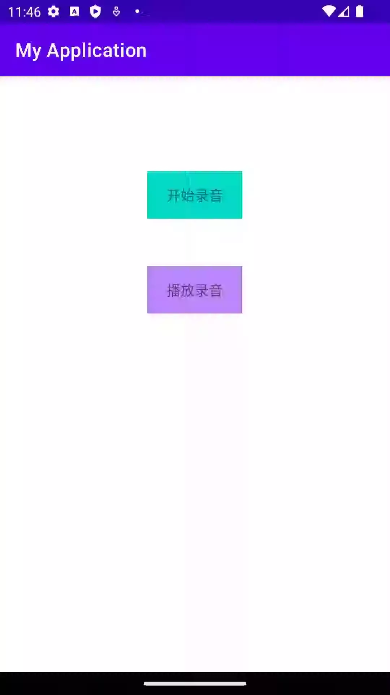

# AudioRecordPlayDemo
此项目是一个功能相对完整的录制mp3格式音频和播放的demo
- 对于录制和播放进行了封装可以作为组件使用；
- 长按进行录制，上滑可以取消录制，下滑又继续录制；上滑取消后不进行存储
- 录制时间太短，不进行存储；录制时间将要超过最大录制时长时会有倒计时，倒计时结束后自动结束录制并存储；
- 录制最短，最大时长，包括倒计时时长都需要自行配置，默认是：
```
    private int RECORD_MAX_INTERVAL = 60;//录制最大时长 单位s
    private int RECORD_MIN_INTERVAL = 3; //录制最小时长 单位s
    private int COUNTDOWN_DURATION = 10; //倒计时时长 单位s
 ```
- 录制的时候对声音分贝做了实时监听类似于发语音的动画；
- 录制成功的音频存在了data/data/包名/cachevoice目录下了(因为Android 10之后对专用目录下的文件操作不用申请读写权限)，没有做删除操作，需要自行处理

关于播放没做UI上的处理，偷懒……不过代码中也实现了播放的回调
```
public interface IAudioPlayListener {
    void onStart(String playPath);

    void onStop(String playPath);

    void onComplete(String playPath);
}
```

**注意**：项目中用到的libmp3lame.so库，使用时注意Mp3Lame.java文件的路径和文件名一定要跟代码中的一致，因为这是编译so库时写好的路径，如果想要更换路径和文件名，可以参考代码[使用lame编译音频mp3转换的so库](https://github.com/zone-yan/mp3lametest)


